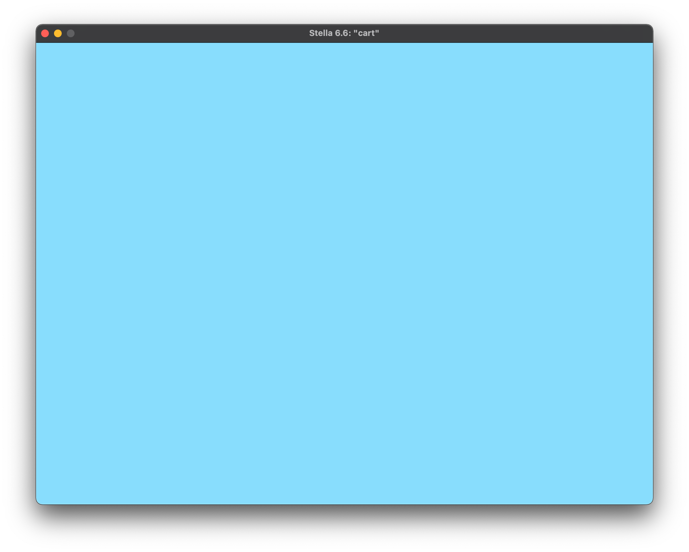

# [**Colour Background Screen**](colourbg.asm)

In order to test out the [**helper**](macro.h) [**files**](vcs.h) and finally put some pixels on the screen of the 2600, we are simply loading a specific colour value (`#$9D`) from the 2600's [**colour palette**](https://en.wikipedia.org/wiki/List_of_video_game_console_palettes#NTSC) and storing it at the `COLUBK` (background colour luminance) address, `$09`. We then run this infinitely:

```asm
START:
    lda #$9D            ; Load colour into A ($9D is a cute NTSC light blue)
    sta COLUBK          ; Store A to BackgroundColour Address $09

    JMP START           ; Repeat from START
```



<sub>**Figure 1**: The resulting screen.</sub>